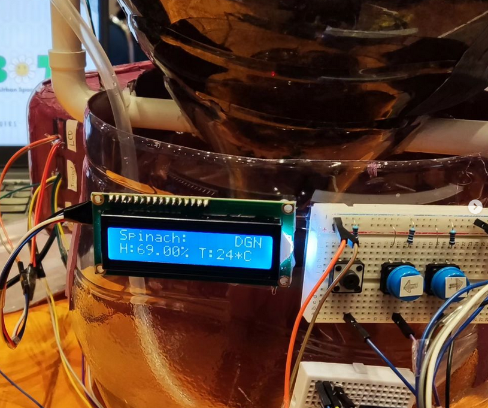
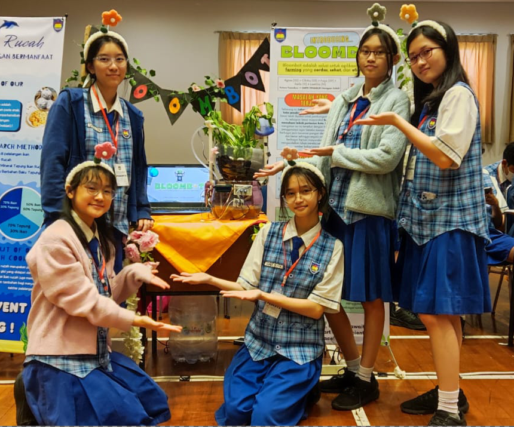

# BloomBot



BloomBot is a smart pot designed for urban farming with accesibility in mind.

Our prototype is built with Arduino Nano V3 (Atmega328P processor with the old bootloader) for the SMP PENABUR Jakarta STEM Project Competition, 2024.

[Read our project proposal](res/PHI%20FUTURE%20FOUNDERS%20-%20PROPOSAL.pdf)

# Code
This code is.. eh... I wrote this in two days. Keep that in mind. This is still very messy and much of the features are not yet implemented, except for the basics.

The main file is located at [bloombot/bloombot.ino](bloombot/bloombot.ino).

# Circuitery
Components:
- Arduino (Nano or Uno)
- Wires and resistors
- Breadboards (our team used a mini breadboard connected to th the arduino nano)
- Soil moisture sensor
- DHT11 temperature and air humidity sensor
- 2-row LCD
- 3 push buttons
- Submersible water pump
- Transistors and/or relay module as needed to amplify digital signal from Arduino and power the water pump

Pin setup can be found at [bloombot/pins.h](bloombot/pins.h).

# Compiling and Uploading Sketch

Get all the libraries used in this code (available via library manager):
- [Ticker](https://github.com/sstaub/Ticker)
- [r89m Buttons](https://github.com/r89m/Buttons)
- [SoilHygrometer](https://github.com/gmarty2000-ARDUINO/arduino-SOIL_HYGROMETER)
- [DHT Sensor library](https://github.com/adafruit/DHT-sensor-library)
- [LiquidCrystal I2C](https://github.com/marcoschwartz/LiquidCrystal_I2C)
- Wire (bundled with the Arduino AVR library)

Then compile and upload the sketch (assuming you're in the root directory of the source code):

```
arduino-cli compile -u -b arduino:avr:nano ./bloombot/bloombot.ino 
```

# Notes

- The type of the DHT sensor has to be defined as `DHT22` to make our sensor work, while it's actually a DHT11.